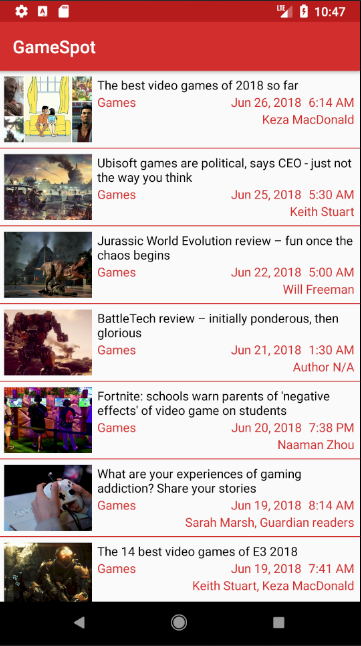
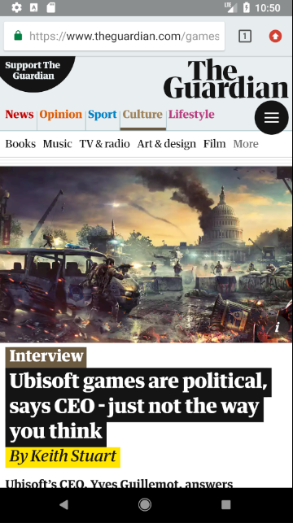
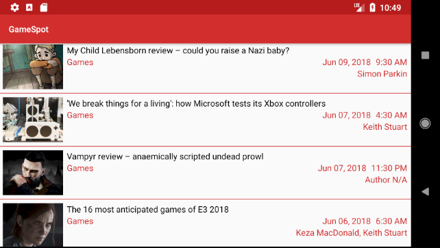

# Udacity and Google India Scholarship Program
## Android Basics Nanodegree Project 6 "News App, Stage 1"

### Name of App - "GameSpot"

This app is using <a href="https://open-platform.theguardian.com/documentation/"> Guardians API</a>.
The app will display the latest news related to Games.  
It will display Image, Title, Section, Published Date and Time, and Authors(If any) related to content.
On click, it will open the article in the browser.

## GameSpot App Images
### Portrait
 

### Landscape

Check out more images in GameSpotImages folder.
